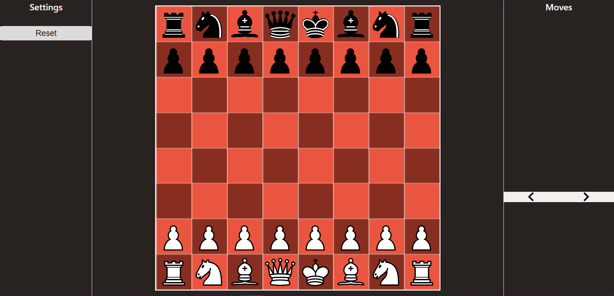

# react-chess

An accurate chessboard with a completly responsive design so that you can see and play your moves as you would in a real two person game. Great for practicing/ playing with someone locally.



## Installation & Running

```
git clone https://github.com/CromulentCoder/react-chess.git
npm install
npm run start
```

## Demo

[Check it out](https://reactchess.vercel.app/)

## Contributing

* Feel free to open pull requests with improvements and suggestions. (Need help with unit tests if you are interested!)
* If you find any bug(s) please create an issue.

## License

GPLv3.0 © [Abhay Sharma](https://devabhay.com/)